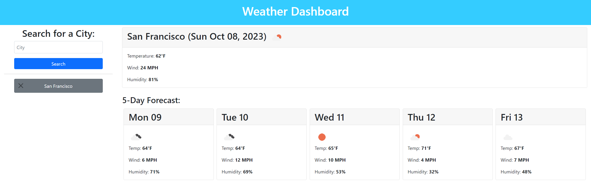
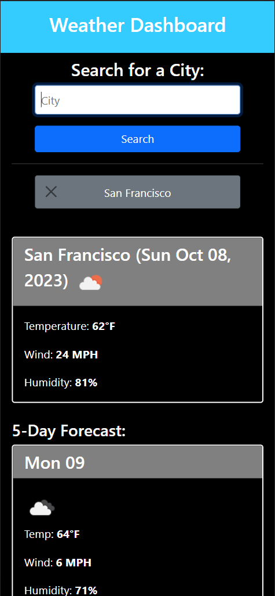

# Weather Dashboard

## Description

The purpose of this repo is to create a weather app that displays the weather and 5-day forecast for a given city. The city is then saved to the browser's local storage and shown to the user in case they want to refer back to that city. The user can also clear any city from the search history at anytime, and it'll remove that from the local storage as well. 

The info shown for the current day is the current temperature and its corresponding weather condition icon, wind and humidity level. The forecast info is similar, it shows the day and date, weather condition icon, temperature, wind, and humidity at what should be the hottest time of the day. 

This website is optimized for both website and mobile, and also accommodates dark mode for both platforms. 

Link to deployment is here: [https://nathangero.github.io/weather-dashboard/](https://nathangero.github.io/weather-dashboard/)

### About OpenWeather
The weather info is from [OpenWeather API's](https://openweathermap.org) free API tier. I've included in the documentation [below](#openweather-api-docs) that I used while making this website. The API is easy to use and the response received is easy to parse as well. Some of the things I like about it:
* It makes it easy to reverse geo locate from a city name to latitude and longitude coordinates. 
* Automatically gives you a 5-day forecast unless specifically changed.
* Provides cute little icons in the API response body for easy use.
* Easy to switch between imperial or metric units in any API call.

### Choices made
* The API gives the forecast weather in 3 hour increments so I decided to find the weather during the hottest part of the day, usually between the time of 12-3pm. I want to give the user the highest temperature possible for that day so they can prepare for it.
* I thought about having the initial search be its own page and then redirect to a results page, but that seemed unneccessary where it being a single page would suffice.

## Technologies Used
* HTML, CSS, JavaScript
* JQuery
* Bootstrap
* OpenWeather API
* GitHub deployment

## Learning Points
* ```JQuery.html()``` and ```JQuery.text()``` will replace each other. Meaning only one can be used at a time.
* `````` is how to show pictures from the internet.
* Using certain Bootstrap elements in the element's class will prevent CSS from adjusting those values. When I was adding mobile screen support, I had to remove the ```w-75``` from the ```div``` elements inside the ```section``` element so I could use media queries and accommodate for dark mode.
    * Meaning in the future, Bootstrap is great for making simple things like a "card" class and adjusting margin/padding, but I shouldn't rely on Bootstrap to do exactly what I want. 
* Cannot use a ```Set()``` for local storage, so I had to convert it to an array with ```Array.from()```
* Async/Await made my code much cleaner and honestly made the API a lot easier to use and follow too.
* Always focus on a mobile view first because it's much easier to go small to big than reverse. I made the mistake of going big to small and I had to refactor quite a bit CSS and Bootstrap code.
* Organizing function names by what they do made it really easy to debug code. For example, anything that would use JQuery to create elements on the page were titled with "display".
* Separating the API URLs in their own file was very helpful in staying organized.

## Code Snippets

Easy use of ```async/await```
```js
async function getWeather(cityName) {
    let coordinates = await getCityLatLon(cityName);
    let lat = coordinates.lat;
    let lon = coordinates.lon;

    if (!lat || !lon) return; // Guard check

    let weatherToday = await fetchWeather(lat, lon);

    if (!weatherToday) return; // Guard check

    let weatherForecast = await fetchForecast(lat, lon);

    if (!weatherForecast) return; // Guard check

    // If all checks pass, then show the user the weather

    /* Display weather functions */
}
```

Displaying the current day's weather
```js
function displayWeatherToday(weatherToday, cityName) {
    let weatherInfo = getWeatherInfo(weatherToday);
    let date = dayjs(weatherInfo.timestamp).format("ddd MMM DD, YYYY")
    $("#city-info").html("") // Remove any currently showing weather

    var card = $('<div>').addClass("card p-0 mt-2");

    var cardHeader = $(`<h2>`).addClass("card-header text-capitalize");
    cardHeader.html(`${cityName} (${date}) `);

    var cardBody = $("<div>").addClass("card-body");
    var temperature = $(`<p>`).addClass("card-text");
    temperature.html("Temperature: <strong>" + weatherInfo.temperature + "&deg" + (units === "imperial" ? "F" : "C") + "</strong>");

    var wind = $(`<p>`).addClass("card-text");
    wind.html("Wind: <strong>" + weatherInfo.wind + (units === "imperial" ? " MPH" : " KM/H") + "</strong>")

    var humidity = $(`<p>`).addClass("card-text");
    humidity.html("Humidity: <strong>" + weatherInfo.humidity + "%</strong>");

    cardBody.append(temperature, wind, humidity);
    card.append(cardHeader, cardBody);
    $("#city-info").append(card);
}
```

Handling white spaces in city names
```js
function buildGeocodeUrl(cityName) {
    const QUERY_LIMIT = 1;

    let cityNameNoSpace = "";
    let split = cityName.split(",")

    for (let i = 0; i < split.length; i++) {
        // First trim leading/trailing whitespace, if there's middle white space then replace with a +
        cityNameNoSpace += split[i].trim().replace(" ", "+");

        // Add commas to all except the last of the string
        if (i < split.length - 1) cityNameNoSpace += ",";
    }

    return `${API_CALL_GEOCODE}${cityNameNoSpace}&limit=${QUERY_LIMIT}&appid=${API_KEY}`;
}
```

## Images

The website look



The mobile look



## Credits

### Coding Resources

[script type="module"](https://stackdiary.com/tutorials/cannot-use-import-statement-outside-module/)

[fetch options](https://developer.mozilla.org/en-US/docs/Web/API/Fetch_API/Using_Fetch)

[async/await](https://developer.mozilla.org/en-US/docs/Web/JavaScript/Reference/Statements/async_function)

[return multiple values in func](https://stackoverflow.com/a/2917186)

[degree symbol](https://www.w3schools.com/charsets/ref_utf_latin1_supplement.asp)

[Set() docs](https://www.w3schools.com/js/js_object_sets.asp)

### Openweather API docs

[Geocoding API](https://openweathermap.org/api/geocoding-api)

[v2.5 weather docs](https://openweathermap.org/current)

[5-day forecast docs](https://openweathermap.org/forecast5)

[Weather icons](https://openweathermap.org/weather-conditions)
